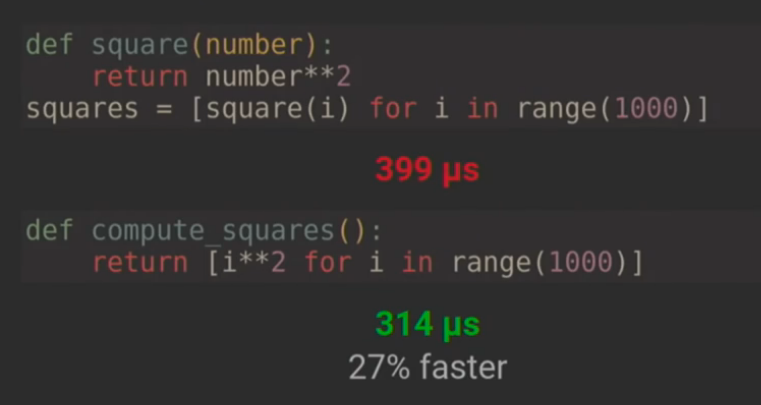
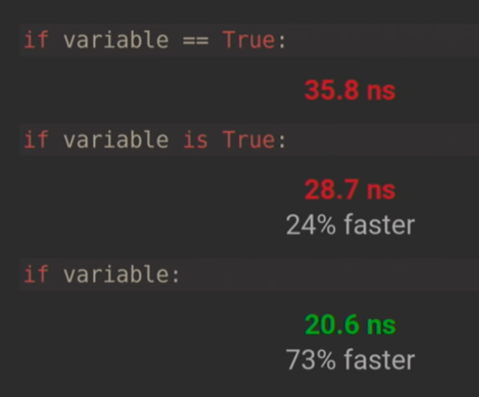
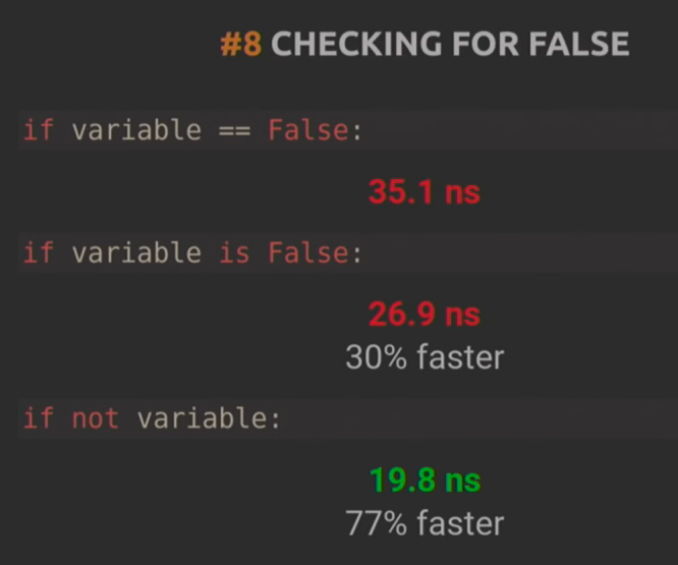
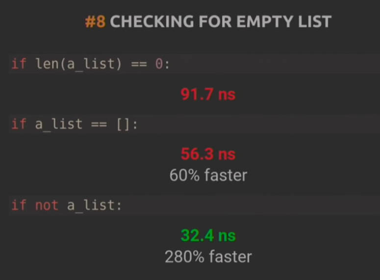
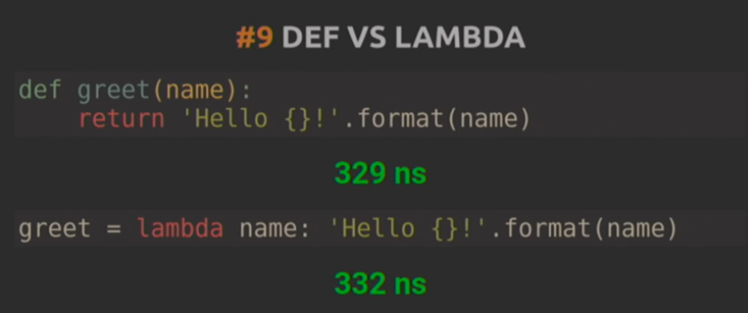
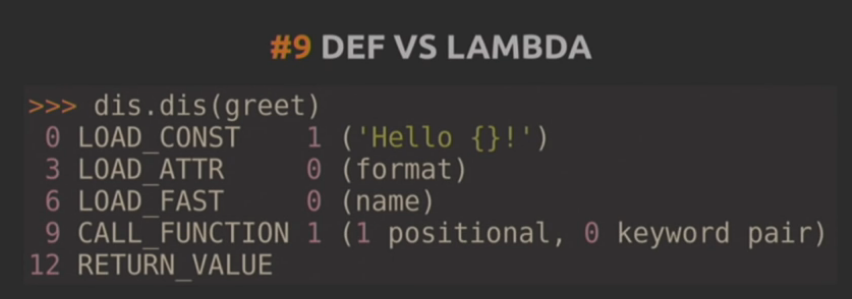

### NOTES ABOUT THE TALK 'WRITING FASTER PYTHON' AT THE EUROPYTHON CONFERENCE (PUBLISHED ON 31 JUL 2016)
### [Sebastian Witowski - Writing faster Python](https://www.youtube.com/watch?v=YjHsOrOOSuI&list=WL&index=32)

Measuring times in Python: The magic method: `%timeit`.
```
%timeit <element> in <collection>
```

If you want to perform the same operation on a large set of data then you have two options you can write a function that performs the operation and call this function `N` times or you can call a function that takes this set of data and performs the operation inside. The second approach will be faster.


The best way to know if a variable is true.


The statement `if [not] variable:` will return `True` unless the variable is `False`, nonzero, empty string, empty list, `None` or other false expression.








[Stack Overflow question on when lambda might be necessary](http://stackoverflow.com/questions/29804774/why-is-lambda-expression-necessary-in-this-example-python)
